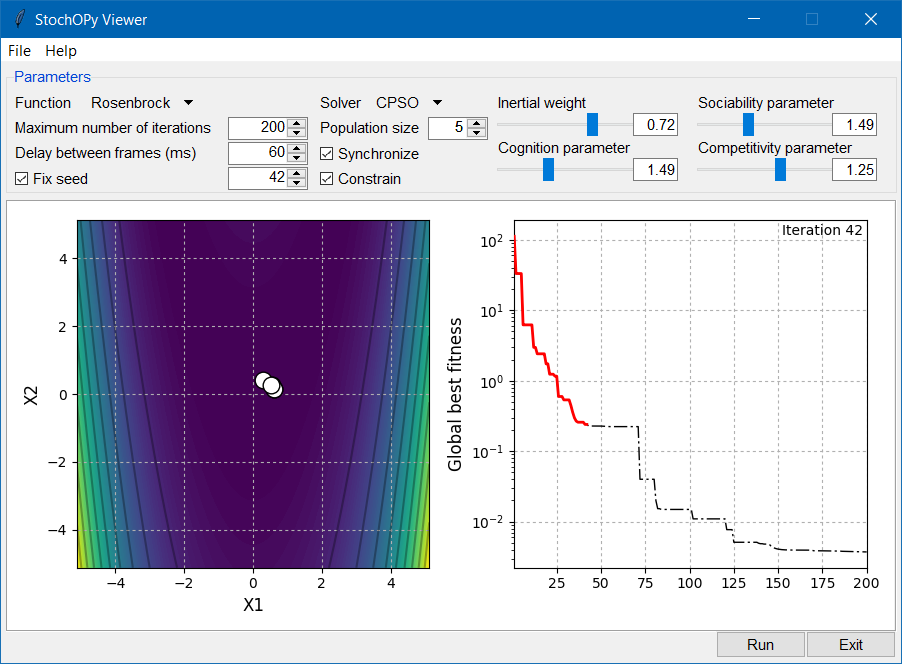

********
StochOPy
********

StochOPy (STOCHastic OPtimization for PYthon) provides user-friendly routines
to sample or optimize objective functions with the most popular algorithms.

:Version: 1.5.2
:Author: Keurfon Luu
:Web site: https://github.com/keurfonluu/stochopy
:Copyright: This document has been placed in the public domain.
:License: StochOPy is released under the MIT License.

**NOTE**: StochOPy has been implemented in the frame of my Ph. D. thesis. If
you find any error or bug, or if you have any suggestion, please don't hesitate
to contact me.

Features
========

StochOPy provides routines for sampling of a model parameter space:

* Pure Monte-Carlo
* Metropolis-Hastings algorithm
* Hamiltonian (Hybrid) Monte-Carlo [1]_ [2]_
              
or optimization of an objective function:

* Differential Evolution [3]_
* Particle Swarm Optimization [4]_ [5]_
* Competitive Particle Swarm Optimization [6]_
* Covariance Matrix Adaptation - Evolution Strategy [7]_

Installation
============

The recommended way to install StochOPy is through pip (internet required):

.. code-block:: bash

    pip install stochopy
    
Otherwise, download and extract the package, then run:

.. code-block:: bash

    python setup.py install
    

Usage
=====

**New in 1.4.0**: added support for MPI for evolutionary algorithms (you may
need to install the package `MPI4PY <https://github.com/mpi4py/mpi4py>`__ beforehand).  
Run the example script inside the folder examples:

.. code-block:: bash

  mpiexec -n 4 python example_mpi.py
  
Note that StochOPy still work even though MPI4PY is not installed.
  
**New in 1.3.0**: run StochOPy Viewer to see how popular stochastic algorithms
work, and play with the tuning parameters on several benchmark functions.

.. code-block:: python

  from stochopy.gui import main
  
  main()
  

First, import StochOPy and define an objective function (here Rosenbrock):

.. code-block:: python

    import numpy as np
    from stochopy import MonteCarlo, Evolutionary
    
    f = lambda x: 100*np.sum((x[1:]-x[:-1]**2)**2)+np.sum((1-x[:-1])**2)
    
You can define the search space boundaries if necessary:

.. code-block:: python

    n_dim = 2
    lower = np.full(n_dim, -5.12)
    upper = np.full(n_dim, 5.12)
    
Initialize the Monte-Carlo sampler:

.. code-block:: python

    max_iter = 1000
    mc = MonteCarlo(f, lower = lower, upper = upper, max_iter = max_iter)
    
Now, you can start sampling with the simple method 'sample':

.. code-block:: python

    mc.sample(sampler = "hamiltonian", stepsize = 0.005, n_leap = 20, xstart = [ 2., 2. ])

Note that sampler can be set to "pure" or "hastings" too.
The models sampled and their corresponding energies are stored in:

.. code-block:: python

    print(mc.models)
    print(mc.energy)
    
Optimization is just as easy:

.. code-block:: python

    n_dim = 10
    lower = np.full(n_dim, -5.12)
    upper = np.full(n_dim, 5.12)
    popsize = 4 + np.floor(3.*np.log(n_dim))
    ea = Evolutionary(f, lower = lower, upper = upper, popsize = popsize, max_iter = max_iter)
    xopt, gfit = ea.optimize(solver = "cmaes")
    print(xopt)
    print(gfit)
    
    
Related works
=============

* `StochANNPy <https://github.com/keurfonluu/stochannpy>`__: StochANNPy (STOCHAstic Artificial Neural Network for PYthon) provides user-friendly routines compatible with Scikit-Learn for stochastic learning.

References
==========
.. [1] S. Duane, A. D. Kennedy, B. J. Pendleton and D. Roweth, *Hybrid Monte Carlo*,
       Physics Letters B., 1987, 195(2): 216-222
.. [2] N. Radford, *MCMC Using Hamiltonian Dynamics*, Handbook of Markov Chain
       Monte Carlo, Chapman and Hall/CRC, 2011
.. [3] R. Storn and K. Price, *Differential Evolution - A Simple and Efficient
       Heuristic for global Optimization over Continuous Spaces*, Journal of
       Global Optimization, 1997, 11(4): 341-359
.. [4] J. Kennedy and R. Eberhart, *Particle swarm optimization*, Proceedings
       of ICNN'95 - International Conference on Neural Networks, 1995, 4: 1942-1948
.. [5] F. Van Den Bergh, *An analysis of particle swarm optimizers*, University
       of Pretoria, 2001
.. [6] K. Luu, M. Noble and A. Gesret, *A competitive particle swarm
       optimization for nonlinear first arrival traveltime tomography*, In SEG
       Technical Program Expanded Abstracts 2016 (pp. 2740-2744). Society of
       Exploration Geophysicists.
.. [7] N. Hansen, *The CMA evolution strategy: A tutorial*, Inria, Université
       Paris-Saclay, LRI, 2011, 102: 1-34
